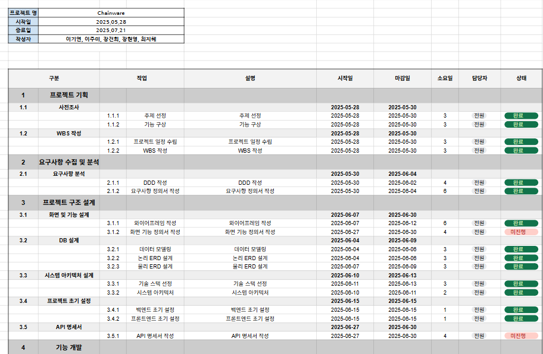
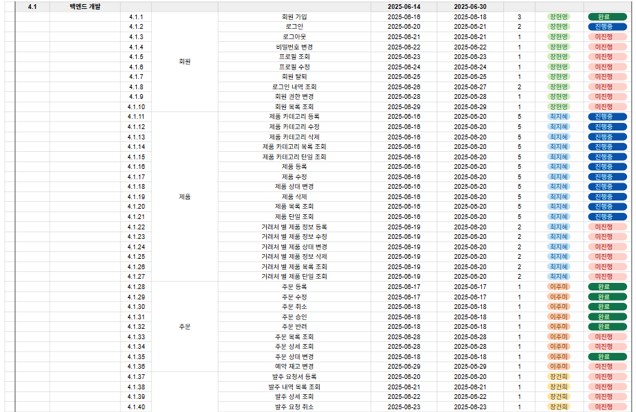
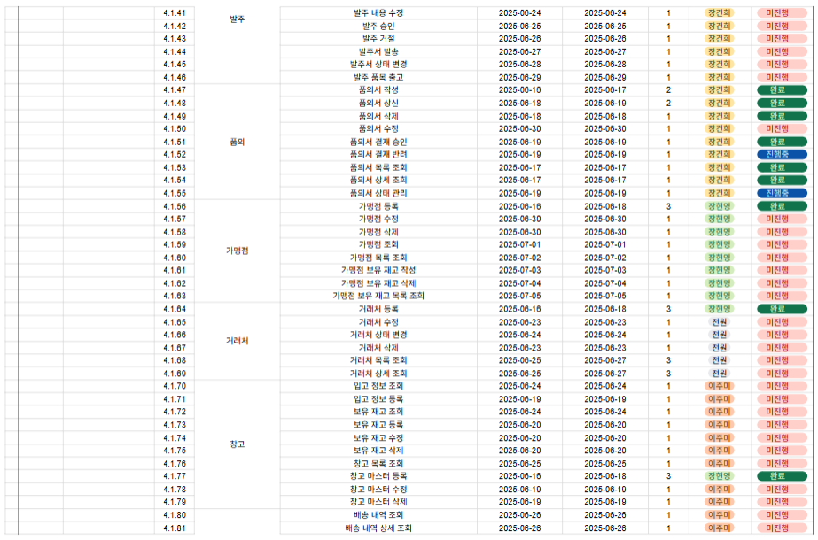
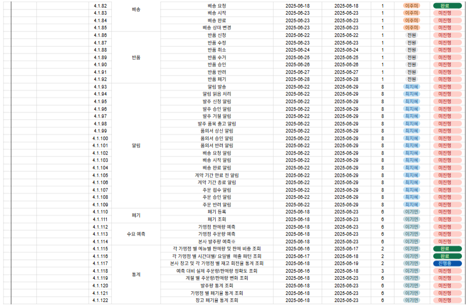
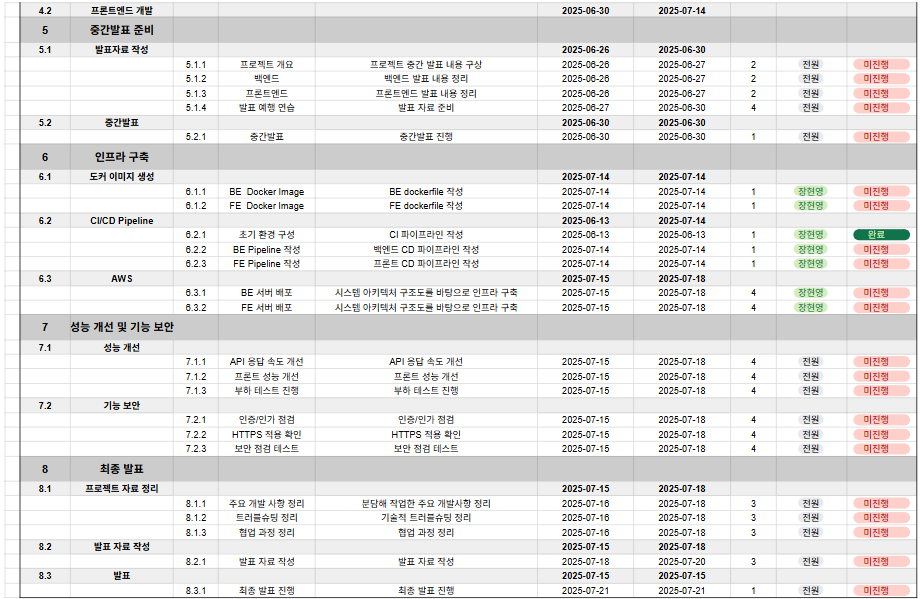

  
  be15-4th-PigMa-HaruSari

### 📌 **CHAINWARE**
복잡한 공급망을 하나의 시스템으로 통합하여  
**투명하고 효율적인 프랜차이즈 운영을 가능하게 하는 SCM 솔루션**입니다.

 

---

## 📚 목차

1. [🐷 harusari 팀 소개](#1--팀-소개)
2. [📘 프로젝트 기획서](#2--프로젝트-기획서)
3. [📊 WBS (작업 분배 및 일정)](#3--wbs-작업-분배-및-일정)
4. [📄 요구사항 정의](#4--요구사항-정의)
5. [📌 ERD](#5--erd--테이블-정의서)
6. [⚙️ 시스템 아키텍쳐](#6--시스템-아키텍쳐)
7. [📒 화면설계서](#12--화면설계서)

 

---

## 1. 🐷 harusari 팀 소개

 

|  |  |  |  |  |
|:------------------------------------------------------------:| :-------------------------------------: | :-------------------------------------------: | :-------------------------------------: | :-------------------------------------: 
|            [이기연](https://github.com/Lee-gi-yeun)             | [이주미](https://github.com/z00m-1n) | [장건희](https://github.com/jang9465) | [장현영](https://github.com/memory-h) | [최지혜](https://github.com/jihye25) 

 

---

## 2. 📘 프로젝트 기획서

🔗 [프로젝트 기획서 링크](https://docs.google.com/document/d/1F1wFwFeltLEnF9YENFLI0bvtUUaCYknNjRCHC5dR2wg/edit?tab=t.0)

## 📦 Chainware SCM Platform

Chainware는 **카페 프랜차이즈**를 위한 **공급망 관리(SCM)** 통합 플랫폼입니다.  
본사, 가맹점, 거래처, 창고 간의 **주문, 발주, 품의, 배송, 반품, 폐기, 재고, 알림, 통계** 등의 업무를 디지털화하여 공급망의 **효율성**, **투명성**, **신속성**을 극대화합니다.

## 📌 프로젝트 개요

### ✅ 추진 배경
- 매장 수 증가, 메뉴/제품 다양화로 인해 공급망 구조 복잡화
- 기존 수작업 및 비표준 방식의 한계 (정보 누락, 배송 지연, 재고 과잉 등)
- 체계적인 제품 관리, 재고 최적화, 실시간 데이터 기반 의사결정 필요

### ✅ 프로젝트 목적
- 공급망 전 과정을 하나의 플랫폼에서 실시간 통합 관리
- 업무 자동화 및 데이터 기반 경영으로 효율성과 경쟁력 강화

## 🧩 주요 기능

### 📁 제품/카테고리 관리
- 계층형(부모/자식) 카테고리 등록
- 제품 등록 시 카테고리 필수 지정
- 거래처별 제품 등록/관리

### 🛒 주문/발주 관리
- 주문 등록, 수정, 취소 및 이력 관리
- 발주 및 품의서 작성, 승인 및 자동 발주 생성

### 🏪 가맹점/거래처/창고 관리
- 가맹점 및 재고 관리
- 거래처 계약 상태 관리
- 창고 입고 및 재고 정보 관리

### 🚚 배송/반품/폐기 관리
- 배송 등록 및 추적, 반품 신청 및 처리
- 폐기 신청 및 이력 관리

### 📊 알림 및 통계
- 실시간 알림
- 주문/판매/재고/폐기 통계 및 분석
- 엑셀, PDF 출력 지원

## 👥 사용자 시나리오

### 📌 가맹점 주문 프로세스
1. 가맹점 → 제품 주문 등록
2. 본사 → 주문 확인 후 창고에 배송 요청
3. 창고 → 배송 시작, 상태 실시간 공유
4. 가맹점 → 배송 수령 및 완료 처리

### 📌 본사 발주 및 품의 프로세스
1. 일반 관리자 → 품의 상신
2. 책임 관리자 → 품의 승인
3. 시스템 → 발주 자동 생성
4. 거래처 → 출고 및 창고 수령

## 🎯 기대 효과

- ✅ **공급망 투명성 확보**: 모든 이력 자동 기록 및 실시간 공유
- ✅ **운영 효율화**: 업무 자동화 및 오류 최소화
- ✅ **제품 체계화**: 카테고리 기반 제품 분류로 빠른 검색 및 통계 분석
- ✅ **데이터 기반 의사결정**: 정확한 수요 예측 및 재고 최적화
- ✅ **리스크 대응력 강화**: 실시간 알림으로 문제 즉시 대응

## 🔮 향후 발전 방향

- 🔗 외부 시스템 연동 (ERP, 회계, POS, 물류 등)
- 🤖 AI 기반 수요 예측 및 자동 발주
- 📊 데이터 대시보드 고도화
- 🌱 ESG 기반 친환경 공급망 관리
- 🌐 글로벌 확장 (다국어/다통화/현지화 대응)

---

## 3. 📊 WBS
🔗 [WBS 링크](https://docs.google.com/spreadsheets/d/1OMJ67HhQXPGCSt0CFpwde2jLPGfOOGp3Mq39YqtatQk/edit?gid=433659874#gid=433659874)

---

## 4. 📄 요구사항 정의

🔗 [요구사항 명세서 링크](https://docs.google.com/spreadsheets/d/1X3JHOtUEBqJ54PKB5uypC5QkqCoK_W_jjFGO8FnzgTU/edit?gid=791323426#gid=791323426)

 

---

## 5. 📌 ERD

🔗 [ERD 링크](https://www.erdcloud.com/d/M5bP6PSAHmyxR3kJb)

 

---

## 6. ⚙️ 시스템 아키텍쳐

 

---

## 7. 📒 화면설계서

🔗 [화면설계서 링크](https://miro.com/app/board/uXjVIurBRVs=/)

 
