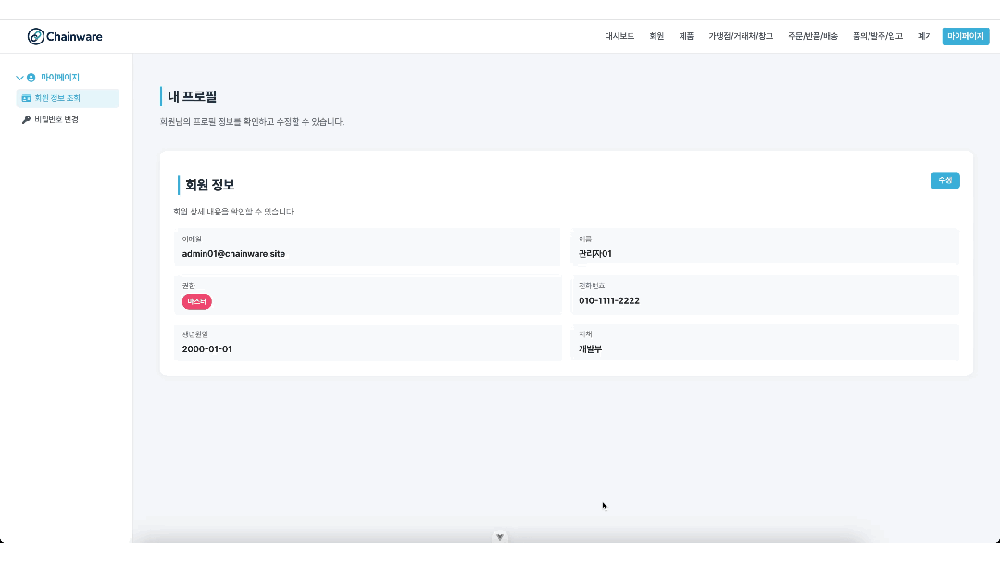

  
  be15-4th-PigMa-HaruSari

### 📌 **CHAINWARE**
복잡한 공급망을 하나의 시스템으로 통합하여  
**투명하고 효율적인 프랜차이즈 운영을 가능하게 하는 SCM 솔루션**입니다.

 

---

## 📚 목차

1. [🐷 harusari 팀 소개](#1--팀-소개)
2. [📘 프로젝트 기획서](#2--프로젝트-기획서)
3. [협업🤝 전략](#3--프로젝트-기획서)
4. [📊 WBS (작업 분배 및 일정)](#4--wbs-작업-분배-및-일정)
5. [📄 요구사항 정의](#5--요구사항-정의)
6. [📌 ERD](#6--erd--테이블-정의서)
7. [⚙️ 시스템 아키텍쳐](#7--시스템-아키텍쳐)
8. [📒 화면설계서](#8--화면설계서)
9. [🔗 프로그램 사양서](#9--프로그램-사양서)
10. [🧑‍💻 단위 테스트 결과서](#10--단위-테스트-결과서)
11. [🐙 UI/UX 단위 테스트](#11--UI/UX-단위-테스트)

 

---

## 1. 🐷 harusari 팀 소개

 

|  |  |  |  |  |
|:------------------------------------------------------------:| :-------------------------------------: | :-------------------------------------------: | :-------------------------------------: | :-------------------------------------: 
|            [이기연](https://github.com/Lee-gi-yeun)             | [이주미](https://github.com/z00m-1n) | [장건희](https://github.com/jang9465) | [장현영](https://github.com/memory-h) | [최지혜](https://github.com/jihye25) 

 

---

## 2. 📘 프로젝트 기획서

🔗 [프로젝트 기획서 링크](https://docs.google.com/document/d/1F1wFwFeltLEnF9YENFLI0bvtUUaCYknNjRCHC5dR2wg/edit?tab=t.0)

## 📦 Chainware SCM Platform

Chainware는 **카페 프랜차이즈**를 위한 **공급망 관리(SCM)** 통합 플랫폼입니다.  
본사, 가맹점, 거래처, 창고 간의 **주문, 발주, 품의, 배송, 반품, 폐기, 재고, 알림, 통계** 등의 업무를 디지털화하여 공급망의 **효율성**, **투명성**, **신속성**을 극대화합니다.

## 📌 프로젝트 개요

### ✅ 추진 배경
- 매장 수 증가, 메뉴/제품 다양화로 인해 공급망 구조 복잡화
- 기존 수작업 및 비표준 방식의 한계 (정보 누락, 배송 지연, 재고 과잉 등)
- 체계적인 제품 관리, 재고 최적화, 실시간 데이터 기반 의사결정 필요

### ✅ 프로젝트 목적
- 공급망 전 과정을 하나의 플랫폼에서 실시간 통합 관리
- 업무 자동화 및 데이터 기반 경영으로 효율성과 경쟁력 강화

## 🧩 주요 기능

### 📁 제품/카테고리 관리
- 계층형(부모/자식) 카테고리 등록
- 제품 등록 시 카테고리 필수 지정
- 거래처별 제품 등록/관리

### 🛒 주문/발주 관리
- 주문 등록, 수정, 취소 및 이력 관리
- 발주 및 품의서 작성, 승인 및 자동 발주 생성

### 🏪 가맹점/거래처/창고 관리
- 가맹점 및 재고 관리
- 거래처 계약 상태 관리
- 창고 입고 및 재고 정보 관리

### 🚚 배송/반품/폐기 관리
- 배송 등록 및 추적, 반품 신청 및 처리
- 폐기 신청 및 이력 관리

### 📊 알림 및 통계
- 실시간 알림
- 주문/판매/재고/폐기 통계 및 분석
- 엑셀, PDF 출력 지원

## 👥 사용자 시나리오

### 📌 가맹점 주문 프로세스
1. 가맹점 → 제품 주문 등록
2. 본사 → 주문 확인 후 창고에 배송 요청
3. 창고 → 배송 시작, 상태 실시간 공유
4. 가맹점 → 배송 수령 및 완료 처리

### 📌 본사 발주 및 품의 프로세스
1. 일반 관리자 → 품의 상신
2. 책임 관리자 → 품의 승인
3. 시스템 → 발주 자동 생성
4. 거래처 → 출고 및 창고 수령

## 🎯 기대 효과

- ✅ **공급망 투명성 확보**: 모든 이력 자동 기록 및 실시간 공유
- ✅ **운영 효율화**: 업무 자동화 및 오류 최소화
- ✅ **제품 체계화**: 카테고리 기반 제품 분류로 빠른 검색 및 통계 분석
- ✅ **데이터 기반 의사결정**: 정확한 수요 예측 및 재고 최적화
- ✅ **리스크 대응력 강화**: 실시간 알림으로 문제 즉시 대응

## 🔮 향후 발전 방향

- 🔗 외부 시스템 연동 (ERP, 회계, POS, 물류 등)
- 🤖 AI 기반 수요 예측 및 자동 발주
- 📊 데이터 대시보드 고도화
- 🌱 ESG 기반 친환경 공급망 관리
- 🌐 글로벌 확장 (다국어/다통화/현지화 대응)

---

## 3. 협업🤝 전략

✔️ 각자 작업 브랜치를 생성하고, 관련 이슈를 등록
 
✔️ 작업을 완료한 후 커밋과 푸시를 진행
 
✔️ PR을 올리면 최소 2명이 코드 리뷰와 승인
 
✔️ 2명 이상 승인 시에만 main 브랜치로 머지 가능

---

## 4. 📊 WBS
🔗 [WBS 링크](https://docs.google.com/spreadsheets/d/1OMJ67HhQXPGCSt0CFpwde2jLPGfOOGp3Mq39YqtatQk/edit?usp=sharing)

---

## 5. 📄 요구사항 정의

🔗 [요구사항 명세서 링크](https://docs.google.com/spreadsheets/d/1X3JHOtUEBqJ54PKB5uypC5QkqCoK_W_jjFGO8FnzgTU/edit?usp=sharing)

 

---

## 6. 📌 ERD

🔗 [ERD 링크](https://www.erdcloud.com/d/M5bP6PSAHmyxR3kJb)

 

---

## 7. ⚙️ 시스템 아키텍쳐

 

---

## 8. 📒 화면설계서

🔗 [화면설계서 링크](https://www.figma.com/design/C02kJemWb1nZGRWeHFSHUX/SCM?node-id=274-808&t=BoIIDbsIVvp1ZoMt-1)

<strong>배송(DL)</strong>

DL-01_배송 등록

DL-02_배송 목록 조회

DL-03_배송 상세 조회

 

<strong>폐기(DP)</strong>

DP-01_가맹점 폐기 신청

DP-02_가맹점 폐기 목록 조회

DP-03_창고 반품 폐기 신청

DP-04_창고 일반 폐기 신청

DP-05_창고 폐기 목록 조회

DP-06_전체 폐기 목록 조회

 

<strong>가맹점(FR)</strong>

FR-01_가맹점 등록

FR-02_가맹점 목록 조회

FR-03_가맹점 상세 조회

FR-04_보유 재고 등록

FR-05_보유 재고 목록 조회

FR-06_보유 재고 상세 조회

 

<strong>회원(MB)</strong>

MB-01_로그인

MB-02_마스터 - 계정 생성

MB-03_로그인이력

 

MB-04_프로필 - 로그인 내역

MB-05_프로필 - 로그인 내역 더보기

 

<strong>제품(PD)</strong>

PD-01_카테고리 목록 조회

PD-02_부모 카테고리 상세 조회

PD-03_자식 카테고리 상세 조회

PD-04_제품 등록

PD-05_제품 목록 조회

PD-06_제품 상세 조회

PD-07_거래처 별 제품 계약 등록

PD-08_거래처 별 제품 계약 목록 조회

PD-09_거래처 별 제품 계약 상세 조회

 

<strong>발주(PO)</strong>

PO-01_발주 목록 조회

PO-02_발주 상세 조회

 

<strong>품의서(RQ)</strong>

RQ-01_품의서 작성

RQ-02_품의서 목록 조회

RQ-03_품의서 상세 조회

 

<strong>주문(SO)</strong>

SO-01_주문 등록

SO-02_주문 목록 조회

SO-03_주문 상세 조회

 

<strong>통계(ST)</strong>

ST-00_기본대시보드

 

<strong>반품(TB)</strong>

TB-01_반품 신청

TB-02_반품 목록 조회

TB-03_반품 상세 조회

 

<strong>거래처(VD)</strong>

VD-01_거래처 정보 등록

VD-02_거래처 목록 조회

VD-03_거래처 상세 조회

 

<strong>창고(WH)</strong>

WH-01_창고 등록

WH-02_창고 목록 조회

WH-03_창고 상세 조회

WH-04_입고 정보 등록

WH-05_입고 목록 조회

WH-06_입고 상세 조회

WH-07_보유 재고 등록

WH-08_보유 재고 목록 조회

WH-09_보유 재고 상세 조회

 

## 9. 🔗 프로그램 사양서

🔗 [Swagger 링크](http://localhost:8080/swagger-ui/index.html#/requisition-query-controller/getRequisitionDetail)
[👉 Swagger PDF 보기](assets/09_Chainware_Swagger.pdf)
 

---

## 10. 🧑‍💻 단위 테스트 결과서

 

---

## 11. 🐙 UI/UX 단위 테스트

<strong>회원</strong>

01_로그인

02_회원 목록

03_회원 상세

04_회원 등록 - 마스터

05_회원 등록 - 가맹점

06_회원 정보 조회

07_비밀번호 변경

08_로그아웃

 

<strong>제품</strong>

1_카테고리

01_카테고리 등록

02_카테고리 수정

03_카테고리 삭제

04_카테고리 목록 조회

05_카테고리 상세 목록 조회

 

<strong>2_제품 마스터</strong>

01_제품 등록

02_제품 수정

03_제품 상태 변경

03_제품 삭제

04_제품 목록 조회

05_제품 상세 목록 조회

 

<strong>3_거래처별 제품 계약 </strong>

01_거래처별 제품 계약 정보 등록

02_거래처별 제품 계약 상태 변경

03_거래처별 제품 계약 정보 목록 조회

04_거래처별 제품 계약 정보 상세 목록 조회 + 수정

 

<strong>주문</strong>

주문 등록

주문 승인

주문 목록 조회

주문 상세 목록 조회

 

<strong>발주</strong>

발주 요청서 등록

발주 승인

발주 내역 목록 조회

발주 상세 목록 조회

 

<strong>품의서</strong>

품의서 작성

품의서 상신

품의서 목록 조회

품의서 상세 목록 조회

 

<strong>가맹점</strong>

가맹점 등록

 

<strong>거래처</strong>

01_거래처 상태 변경

02_거래처 목록 조회

03_거래처 상세 목록 조회 + 수정

 

<strong>창고</strong>

<strong>입출고</strong>

입고 정보 등록

입고 정보 조회

 

<strong>재고</strong>

보유 재고 등록

보유 재고 조회

 

<strong>마스터</strong>

창고 마스터 등록

창고 목록 조회

 

<strong>배송</strong>

배송 상태 변경

배송 내역 조회

배송 내역 상세 조회

 

<strong>반품</strong>

반품 신청

반품 승인

반품 폐기

 

<strong>폐기</strong>

폐기 등록

폐기 조회

 

<strong>통계</strong>

<strong>수요 예층</strong>

가맹점 판매량 예측

가맹점 주문량 예측

본사 발주량 예측

 

<strong>통계 표시</strong>

각 가맹점 별 메뉴별 판매량 및 판매 비중 조회

각 가맹점 별 시간대별/ 요일별 매출 패턴 조회

본사 창고 및 각 가맹점 별 재고 회전율 통계 조회

예측 대비 실제 주문량/판매량 정확도 조회

계절 별 주문량/판매량 변화 조회

발주량 통계 조회

가맹점 별 폐기율 통계 조회

창고 폐기율 통계 조회

---

